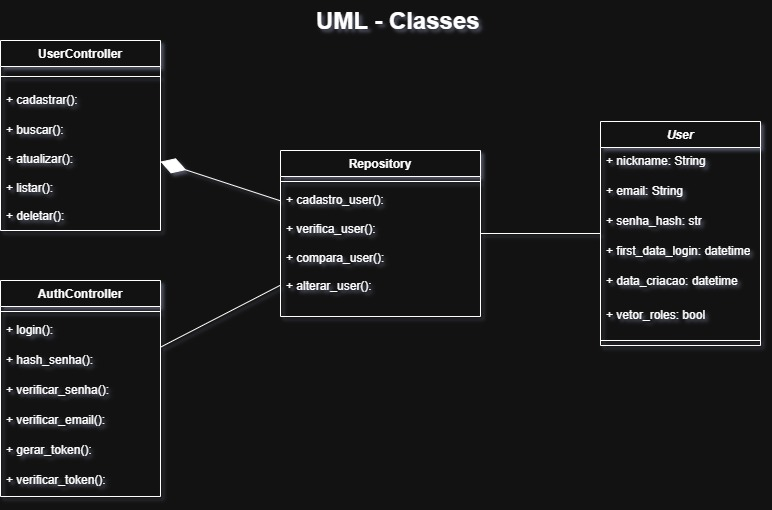
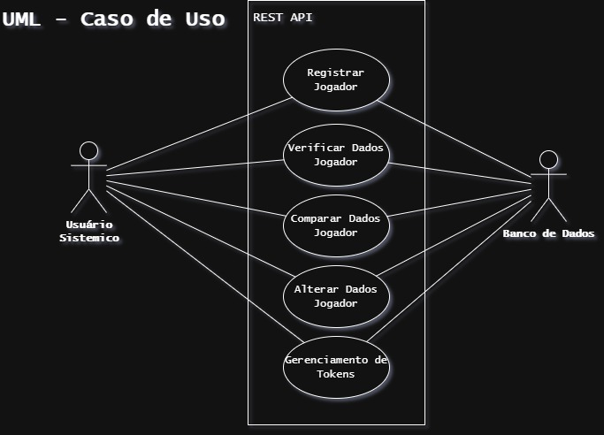

# Projeto_Tema1_Equipe7

Este repositório contém a implementação do projeto **Tema 1**, desenvolvido pela **Equipe 7**.

---

## Diagramas:

===========================================================================

## Integrantes da Equipe:

- Bernardo Sartori Castilho de Souza
- Júlio César Taranto Azevedo
- André Augusto Coelho Silva
- Arthur Oliveira Rabelo
- Henrique Fonseca de Castro
- Tiago Gonçalves Giugni Filho

===========================================================================

## Formulario de Alinhamento:

https://forms.gle/88vt7ycirvyYDqqW7

===========================================================================

## Apresentação:
[Clique aqui para assistir à apresentação](https://youtu.be/mk0rJzqEWw0)
